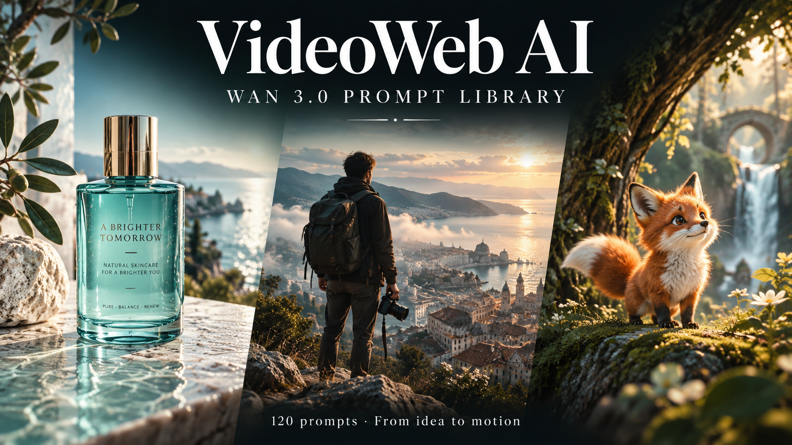

# 🎬 Awesome Wan 3.0 Prompts — Biblioteca de prompts para vídeo con IA

Esta edición adapta la colección de Flaq AI con licencia MIT. Los 120 textos están en chino simplificado e inglés y no se han probado todos en VideoWeb; esta página ofrece una introducción y un ejemplo en español. [Fuentes e imágenes](UPSTREAM.md).

[](README.es.md)
[](README.zh-CN.md)
[](README.md)
[](README.ja.md)

> Una colección práctica de **120 prompts para Wan 3.0**, pensados para cine, publicidad, comercio y belleza, diálogo y localización, naturaleza, industria, educación, arquitectura, movilidad y control de producción.

Puedes [enviar un prompt probado mediante el formulario](https://github.com/aivideoweb/awesome-wan-3-0-prompts/issues/new?template=prompt.yml) o consultar la [guía de contribución](CONTRIBUTING.md) para aportar traducciones y nuevas categorías.



## Crear con VideoWeb AI

Abre [Wan 3.0 en VideoWeb AI](https://videoweb.ai/model/wan-3-0/), elige texto o imagen, pega el prompt y selecciona los ajustes disponibles. Empieza con una toma corta y cambia una sola variable cada vez. [Guía en inglés](guides/videoweb-workflow.md) · [Vídeos de X](guides/x-community-showcase.md).

## Qué incluye

- Acciones con causa, proceso y resultado visible, no listas de palabras clave.
- Plantillas para texto a vídeo, imagen a vídeo, fotograma inicial/final, referencias y edición.
- Indicaciones de cámara, ritmo, luz, sonido, continuidad de personajes y geometría de producto.
- Separación entre el idioma de la descripción visual y el idioma exacto del diálogo.
- Escenas y portadas de categorías heredadas de la colección original; portada de VideoWeb creada para esta edición. Las imágenes son ilustraciones, no resultados de vídeo verificados.

> La duración, resolución, cantidad de referencias y funciones de audio de Wan 3.0 pueden variar según región, producto o fase de prueba. Usa siempre los controles y la documentación de la plataforma que tengas disponible.

## Fórmula rápida

```text
[Salida] duración + relación de aspecto + medio visual
[Sujeto] rasgos de identidad reutilizables + detalles inmutables
[Mundo] momento + lugar + clima + profundidad espacial
[Acción] detonante → movimiento continuo → resultado visible
[Cámara] plano + ángulo + un recorrido + encuadre final
[Aspecto] luz + paleta + materiales + tratamiento del movimiento
[Sonido] ambiente + acciones + música + diálogo, si está disponible
[Límites] qué debe permanecer + errores más probables
```

## Categorías

| Categoría | Prompts | Abrir |
|---|---:|---|
| Narrativa cinematográfica | 6 | [Ver](prompts/cinematic-storytelling.md) |
| Publicidad y productos | 6 | [Ver](prompts/ads-and-products.md) |
| UGC, comida y viajes | 6 | [Ver](prompts/ugc-food-travel.md) |
| Acción y deporte | 6 | [Ver](prompts/action-sports.md) |
| Animación y fantasía | 6 | [Ver](prompts/anime-fantasy.md) |
| Música, comedia y redes | 6 | [Ver](prompts/music-comedy-social.md) |
| Empresa y servicios públicos | 11 | [Ver](prompts/professional-business.md) |
| Educación y ciencia | 11 | [Ver](prompts/education-science.md) |
| Arquitectura, hotelería y movilidad | 11 | [Ver](prompts/architecture-mobility.md) |
| Control de producción y edición | 11 | [Ver](prompts/production-control.md) |
| Comercio, belleza y venta minorista | 10 | [Ver](prompts/commerce-beauty-retail.md) |
| Personas, diálogo y localización | 10 | [Ver](prompts/people-dialogue-localization.md) |
| Naturaleza, animales y estaciones | 10 | [Ver](prompts/nature-animals-seasons.md) |
| Industria y fabricación | 10 | [Ver](prompts/industrial-manufacturing.md) |

## Prompt de prueba completo

```text
8 segundos, 16:9, imagen cinematográfica naturalista. Al amanecer, en una calle antigua mojada por la lluvia, un joven cartero con abrigo verde oscuro cruza un charco poco profundo en una bicicleta clásica. La rueda delantera divide el agua en dos salpicaduras bajas; las gotas vuelven al empedrado en lugar de flotar. La cámara acompaña de forma estable desde atrás a la izquierda, a la altura de la rodilla, comienza con un plano medio que muestra la calle, se acerca a la mano y al timbre y después se eleva hacia la luz cálida al final de la calle. Sonido: neumático en el agua, una persiana metálica lejana y un timbre de bicicleta claro. Mantener el rostro, el abrigo, la geometría de la bicicleta y la dirección. Sin texto, logotipos, extremidades adicionales, saltos de montaje ni objetos flotantes.
```

Ejemplo de diálogo multilingüe:

```text
Descripción visual: español neutro con vocabulario de producción cinematográfica.
Diálogo hablado: español de México, tono cálido y velocidad natural.
Línea exacta: “Todavía nos queda un poco de luz.”
Sin subtítulos. La persona que escucha mantiene la boca cerrada y asiente una sola vez.
```

No dupliques todo el prompt en varios idiomas. Usa un idioma principal para la imagen y conserva en el idioma de destino únicamente el diálogo o el texto exacto.

Consulta la [guía de escritura](guides/prompting-guide.md), el [directorio de 15 idiomas](locales/README.md) y el [manual de problemas frecuentes](guides/troubleshooting.md). Este es un recurso comunitario independiente, no una publicación oficial del proveedor del modelo.

## Programa de afiliados de VideoWeb AI

[VideoWeb AI ofrece actualmente un programa de afiliados](https://videoweb.ai/affiliate-program/) para desarrolladores, creadores, educadores, analistas y equipos que recomienden sus herramientas de creación de vídeo, imágenes y música con IA. Inicia sesión con una cuenta normal de VideoWeb AI, completa el perfil y el acuerdo de afiliación, crea tu propio enlace de referencia y compártelo en tutoriales, reseñas, comunidades, productos o sitios web.

- **20%** por el primer pedido de pago válido de un usuario referido.
- **10%** por los pedidos de pago válidos posteriores realizados durante la **ventana de atribución de 60 días** desde el registro.
- Los reembolsos, contracargos, pedidos cancelados por riesgo, atribución y abuso de las políticas se revisan antes de que la comisión sea pagadera.

Las reglas pueden cambiar. Consulta la página y el Affiliate Agreement vigentes antes de promocionar VideoWeb AI. El enlace anterior dirige al programa oficial y no es un enlace de referencia de este proyecto.
