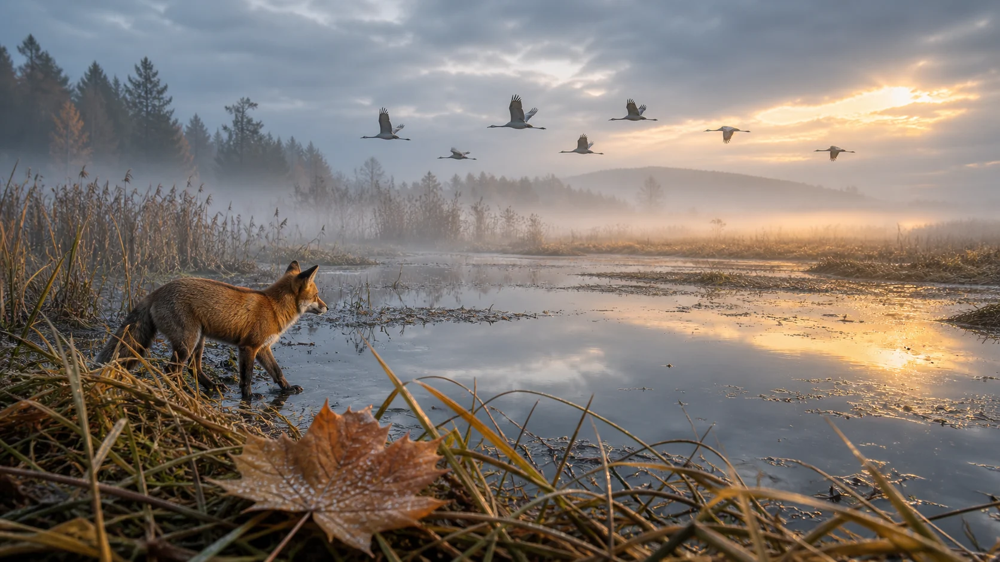
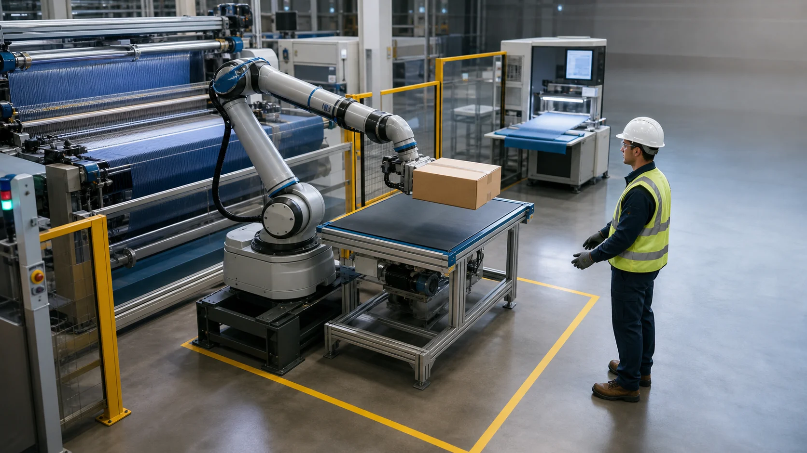

# 🎬 Awesome Wan 3.0 Prompts — 120 Video Prompts

[](README.md) [](README.zh-CN.md) [](README.ja.md) [](README.es.md) [](prompts/README.md) [](https://github.com/aivideoweb/awesome-wan-3-0-prompts/pulls) [](LICENSE)

[繁體中文](README.zh-TW.md) · [한국어](README.ko.md) · [Français](README.fr.md) · [Deutsch](README.de.md) · [Português](README.pt-BR.md) · [Italiano](README.it.md) · [العربية](README.ar.md) · [Русский](README.ru.md) · [Bahasa Indonesia](README.id.md) · [ไทย](README.th.md) · [Tiếng Việt](README.vi.md) · [15 language guides](locales/README.md)

**120 complete video prompt templates across 14 categories, ready to adapt to your platform**, for creators making product ads, short films, social clips and explainers. Choose a scene, adapt its actions and camera instructions, then try it in [Wan 3.0 on VideoWeb AI](https://videoweb.ai/model/wan-3-0/).

**[Find a prompt](#start-here) · [Copy a starter](#quick-start) · [Watch examples](#community-videos) · [All 14 categories](#categories)**


*VideoWeb edition of a community prompt library. This cover is an editorial illustration, not a Wan 3.0 output.*

<a id="start-here"></a>

## Start with what you want to make

| Your goal | Open this brief | What to focus on |
|---|---|---|
| My first short video | [10-second mug scene](#quick-start) · English | One action and a fixed camera; no input image needed |
| A product ad | [Folding headphones](prompts/ads-and-products.md#prompt-02) · 中文 | Keep hinges and product geometry consistent |
| A vertical travel clip | [Seaside stay diary](prompts/ugc-food-travel.md#prompt-02) · 中文 | Four connected shots in 15 seconds |
| Dialogue with two languages | [Museum welcome](prompts/people-dialogue-localization.md#prompt-01) · English | One speaker at a time; silent listeners |
| Wildlife close-ups | [Hummingbird at a flower](prompts/nature-animals-seasons.md#prompt-03) · English | Motion, anatomy and a fixed viewpoint |
| A reusable editing asset | [Green-screen performance](prompts/production-control.md#prompt-01) · English | Full-body framing and clean edges; check reference-mode support |

[Browse all 120 titles](prompts/README.md) · [6 extra practice briefs](prompts/community-practice.md) · Download the 120 core + 6 practice briefs: [JSON](downloads/prompts.json) / [plain text](downloads/prompts.txt).

The 120 core prompts come from the upstream collection; the 6 extras are separate untested exercises. They are not verified VideoWeb outputs. Category files use Chinese or English. The [15 language editions](locales/README.md) provide introductions and a comparison example, not full translations of every prompt. [Sources and media credits](UPSTREAM.md).

<a id="quick-start"></a>

## Make your first video on VideoWeb AI

1. Open [Wan 3.0 on VideoWeb AI](https://videoweb.ai/model/wan-3-0/). For this text-only example, use **Text / Image to Video** and leave **Start Frame** empty.
2. Set **10 seconds, 16:9** in the form, choose an available resolution and paste the prompt below. Review the displayed charge before generating.
3. Watch the whole result: the lid should open once, the mug should keep its shape and the camera should stay fixed. If it fails, simplify one action and compare the next result.

```text
10 seconds, 16:9.

A plain ceramic travel mug sits on a wooden kitchen counter beside a bright window.
The camera stays fixed at tabletop height.
During seconds 0–2 the closed mug remains still.
During seconds 2–6 an adult hand lifts the hinged lid once and moves out of frame.
During seconds 6–10 a thin curl of steam rises while the mug stays completely still.
Soft morning light, realistic ceramic texture.
If audio is supported: one gentle lid click and quiet room ambience.
Preserve mug shape, handle position and lid hinge.
No logos, writing, extra fingers, camera cuts or melting objects.
```

This starter is an untested editorial example. It is not the prompt behind a community video. Have a product photo instead? Use **Choose Start Frame**, upload your image and describe how it should move. See the [full step-by-step guide](guides/videoweb-workflow.md).

**Adapt the settings before copying.** The form checked on 2026-09-22 offered 5, 10, 15, 20, 25 and 30 seconds. For an 8- or 12-second library brief, choose an available duration and retime each action. If 2.39:1 is unavailable, use an offered ratio, leave room around the subject and crop later. Prompt text does not override the form. Audio, end frames, reference inputs and video editing need matching controls in the selected mode.

<a id="categories"></a>

## Prompt categories

Need one place to scan every title? Open the [120-scene master index](prompts/README.md).

| Category | Prompts | Includes | Open |
|---|---:|---|---|
| Cinematic storytelling | 6 | drama, suspense, period scenes, one-take shots | [Browse](prompts/cinematic-storytelling.md) |
| Ads and products | 6 | beauty, food, technology, home, automotive | [Browse](prompts/ads-and-products.md) |
| UGC, food and travel | 6 | vlogs, street food, stays, workshops, ASMR | [Browse](prompts/ugc-food-travel.md) |
| Action and sports | 6 | pursuit, snowboarding, volleyball, parkour, VFX | [Browse](prompts/action-sports.md) |
| Animation and fantasy | 6 | 2D, 3D, stop motion, East Asian fantasy, sci-fi | [Browse](prompts/anime-fantasy.md) |
| Music, comedy and social | 6 | live music, dance, rap, pets, office comedy, loops | [Browse](prompts/music-comedy-social.md) |
| Professional business and public service | 11 | SaaS, creator courses, podcasts, accessibility, telehealth, logistics | [Browse](prompts/professional-business.md) |
| Education and science | 11 | climate, microscopy, safety, astronomy, marine science, museums | [Browse](prompts/education-science.md) |
| Architecture, hospitality and mobility | 11 | real estate, public space, accessible routes, e-bikes, transit, hotels | [Browse](prompts/architecture-mobility.md) |
| Production control and editing | 11 | green screen, previs, product rotation, local edits, reference roles, loops | [Browse](prompts/production-control.md) |
| Commerce, beauty, and retail | 10 | fit demos, shoppable video, skincare, packaging, accessible retail, catalog batches | [Browse](prompts/commerce-beauty-retail.md) |
| People, dialogue, and localization | 10 | speaker turns, dubbing, sign language, podcasts, oral history, micro-drama | [Browse](prompts/people-dialogue-localization.md) |
| Nature, animals, and seasons | 10 | wildlife, animal care, weather, macro nature, seasonal change, observatories | [Browse](prompts/nature-animals-seasons.md) |
| Industrial and manufacturing | 10 | training, cobots, inspection, cold chain, digital twins, multi-SKU production | [Browse](prompts/industrial-manufacturing.md) |

<a id="community-videos"></a>

## Learn from community videos

**9 sourced X cases, including 4 with complete author prompts.** These two are useful starting points. Click a preview or the watch link to open the video on X; login may be required. These are third-party results, not VideoWeb reproductions.

### One character, one direction — [@0xbisc](https://x.com/0xbisc)

<a href="https://x.com/0xbisc/status/2093296541834653883/video/1"></a>

Study how the prompt keeps the threat behind the running character and carries the action through 30 seconds. **To reproduce it:** the author's brief requires Image1, which is not supplied here. The post is marked as a paid partnership.

[▶ Watch video](https://x.com/0xbisc/status/2093296541834653883/video/1) · [Read the complete author prompt](https://x.com/0xbisc/status/2093296546926539136) · [Try a separate chase exercise](prompts/community-practice.md#prompt-03) · [Source notes](guides/x-community-showcase.md#void-escape)

### Five connected story beats — [@chatgptpaglu](https://x.com/chatgptpaglu)

<a href="https://x.com/chatgptpaglu/status/2094710054675157354/video/1"></a>

Study a 30-second fictional mountain story planned as five 6-second shots: read each shot, then check character continuity and how the next action follows from the previous one. The author names Wan 3.0 on Lart; full settings and a seed are not available here.

[▶ Watch video](https://x.com/chatgptpaglu/status/2094710054675157354/video/1) · [Read the complete author prompt](https://x.com/chatgptpaglu/status/2094710054675157354) · [Source notes](guides/x-community-showcase.md#cable-car-story)

[Browse all 9 cases and their prompt availability](guides/x-community-showcase.md). The [6 practice briefs](prompts/community-practice.md) are separate, untested exercises, not the source prompts for these videos.

## Choose an input and adapt the brief

| What you have | Workflow | What to write or check |
|---|---|---|
| Only an idea | Text to video | Describe one event, its setting and one camera movement |
| A product or character image | Image to video | Upload a start frame; describe motion and what must stay unchanged |
| An opening and closing image | Start/end frames, where supported | Check for separate input fields; explain the transition between them |
| Identity, style or motion references | Reference to video, where supported | Give each input one role; a pasted URL is not an uploaded reference |
| Existing footage to change | Video editing, where supported | Use an actual edit mode; identify one change and preserve everything else |
| Dialogue or sound | An audio-capable mode | Specify speaker, language, timing and pauses; keep listeners silent |

VideoWeb's starting workflow is covered in the [English guide](guides/videoweb-workflow.md). Broader [prompting advice](guides/prompting-guide.md), [platform compatibility](guides/model-capabilities.md) and [troubleshooting](guides/troubleshooting.md) are in Simplified Chinese. These library workflows do not imply that every mode is available in the VideoWeb form.

## Write a prompt you can revise

```text
[Output] duration + aspect ratio + visual medium
[Subject] consistent identifying details + what must not change
[World] time + place + weather + spatial layers
[Action] trigger → continuous motion → visible result
[Camera] shot size + angle + one movement path + ending frame
[Look] light + palette + material + motion treatment
[Sound] ambience + action sound + music + dialogue, if supported
[Constraints] what must remain + the most likely failure modes
```

<details>
<summary>10 practical rules for revising a result</summary>

1. Build each short around one primary event.
2. Repeat three to five identifying details, such as clothing and hair, without changing their wording.
3. Write motion as “first, then, finally.”
4. Assign one main camera movement per shot.
5. For image-to-video, describe motion more than static appearance.
6. Show speed through water, dust, clothing, parallax, and sound.
7. Lock product geometry, material, label, cap, and button positions.
8. Keep dialogue short enough for natural pauses.
9. Use three to six scene-specific negative constraints.
10. Add one complex variable per iteration.

</details>

## Explore four production themes

The illustrations below are inherited concept artwork, not generated video results.

<details>
<summary>Open illustrated collections: commerce, dialogue, nature and manufacturing</summary>

### Commerce, beauty, and retail

[](prompts/commerce-beauty-retail.md)

Shoppable demonstrations, fit and texture comparisons, accessible product use, packaging continuity, consultations, and repeatable catalog campaigns. [Open 10 prompts →](prompts/commerce-beauty-retail.md)

### People, dialogue, and localization

[](prompts/people-dialogue-localization.md)

Clean speaking turns, multilingual dialogue, localized dubbing, sign-language framing, podcasts, documentary voiceover, and oral history. [Open 10 prompts →](prompts/people-dialogue-localization.md)

### Nature, animals, and seasons

[](prompts/nature-animals-seasons.md)

Patient wildlife observation, animal-care routines, macro physics, weather transitions, seasonal change, and non-invasive documentary direction. [Open 10 prompts →](prompts/nature-animals-seasons.md)

### Industrial and manufacturing

[](prompts/industrial-manufacturing.md)

Safety rehearsals, cobot handoffs, facility explainers, inspection, cold-chain continuity, digital-twin overlays, and multi-SKU generation. [Open 10 prompts →](prompts/industrial-manufacturing.md)

</details>

## Multilingual prompting

Use one main language for the visual description and isolate exact dialogue:

```text
Visual description: English cinematic production language.
Spoken dialogue: Mandarin Chinese, relaxed natural delivery.
Exact line: “今天的风，终于往海边吹了。”
No subtitles. The listener keeps their mouth closed and reacts with one small nod.
```

Avoid duplicating the entire prompt in multiple languages. Keep camera and material terminology in the main language; preserve only exact spoken or on-screen text in its target language.

The [15-language directory](locales/README.md) provides a localized prompt formula and the same complete comparison scene in every supported language: English, Simplified Chinese, Traditional Chinese, Japanese, Korean, Spanish, French, German, Brazilian Portuguese, Italian, Arabic, Russian, Indonesian, Thai, and Vietnamese.

## Contribute a prompt or a useful source

- Generated a result worth studying? [Submit a tested prompt](https://github.com/aivideoweb/awesome-wan-3-0-prompts/issues/new?template=prompt.yml) with its exact text, inputs, platform, settings and result. The [generation record](templates/generation-record.md) helps keep those details together.
- Found another creator's example? [Suggest an external source](https://github.com/aivideoweb/awesome-wan-3-0-prompts/issues/new?template=source.yml), keeping its author and original link.
- Improving wording or coverage? [Contribute a translation](CONTRIBUTING.md#translations) or [open a pull request](https://github.com/aivideoweb/awesome-wan-3-0-prompts/pulls). Read the [contribution guide](CONTRIBUTING.md) and [maintenance guide](MAINTAINING.md).

## Sources and license

The 120 core briefs and seven category illustrations come from the MIT-licensed upstream project. VideoWeb adds its own cover, browser guide, source-linked video cases and separate exercises. [UPSTREAM.md](UPSTREAM.md) records the source revision and media credits; [LICENSE](LICENSE) retains the original copyright. Third-party X media stays with its creators. This is a community resource, not an official model-provider publication.

## VideoWeb AI Affiliate Program

[VideoWeb AI currently offers an affiliate program](https://videoweb.ai/affiliate-program/) for developers, creators, educators, reviewers, and teams that recommend its AI video, image and music creation tools. Sign in with a regular VideoWeb AI account, complete the affiliate profile and agreement, generate your own referral link, and share that link in tutorials, reviews, communities, products, or websites.

- Earn **20%** on a referred user's first valid paid order.
- Earn **10%** on following valid paid orders made within the **60-day attribution window** after registration.
- Refunds, chargebacks, risk-cancelled orders, attribution status, and policy abuse are reviewed before commission becomes payable.

Program rules may change. Review the current affiliate page and agreement before promoting VideoWeb AI. The link above is the official program page, not this project's referral link.
